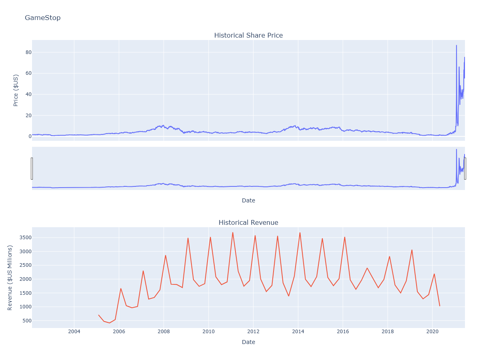

# Module 5: Extracting and Visualizing Data

**Author:** Alexander Booth
**Cohort:** May 2026 (IBM Data Analyst / IBDA)

---

## Overview

This module is centered on **bringing data into your workflow** from external sources like the web and financial APIs. You’ll work with **web scraping tools** (HTML, Requests, BeautifulSoup) to pull information from web pages, along with **Python libraries** such as **yfinance** to access structured financial data.

The goal is simple: take data that exists “out in the world” and turn it into **DataFrames and visualizations** you can actually use.

The core takeaway:

> Data analysis begins with data. In this module, you’ll learn how to **collect** it from web and financial sources, then **visualize** it to support data-driven decisions.

---

## Why Data Extraction Matters

In practice, data is rarely handed to you in a clean CSV. It typically lives in:

* **Web pages** — tables, lists, and text (e.g. rankings, revenue, listings)
* **Financial platforms** — stock prices, dividends, company fundamentals

Using **web scraping** and tools like **yfinance**, you can:

* Replace manual copy-paste work with automated scripts
* Build repeatable pipelines that update with fresh data
* Combine multiple sources into a single analysis

At its core, this module answers a key question: *Where do we actually get data?*
The answer: from APIs and the web, using Python.

---

## What This Module Covers

The content is structured as a **step-by-step progression**, moving from basic HTML concepts to a full data extraction and visualization project.

### 1. HTML for Web Scraping

* **HTML fundamentals** — Understanding page structure (`html`, `head`, `body`)
* **Tags and attributes** — How elements store content and metadata
* **Document tree** — Parent, child, and sibling relationships
* **Tables** — How tabular data (`table`, `tr`, `th`, `td`) is structured for scraping

### 2. Web Scraping with BeautifulSoup and Requests

* **Web scraping basics** — Extracting data from websites programmatically
* **BeautifulSoup** — Parsing HTML into a navigable structure
* **Core objects** — Tag, NavigableString, and tree navigation
* **Attributes** — Accessing metadata like `id` and `href`
* **Filtering** — Using `find()` and `find_all()` to locate data
* **Requests** — Downloading page content with `requests.get()`
* **Workflow** — Fetch → parse → extract → structure into DataFrames

### 3. Web Scraping Review Lab

Hands-on practice working with:

* HTML navigation and object types
* Filtering and tag selection
* Extracting structured data from real or sample pages

### 4. Extracting Stock Data with a Python Library

* **Stocks and tickers** — Understanding identifiers like AAPL or TSLA
* **yfinance basics** — Creating Ticker objects
* **Company data** — Accessing metadata via `.info`
* **Historical prices** — Using `.history()` for time series data
* **Dividends** — Retrieving payout history when relevant

### 5. Extracting Stock Data with Web Scraping

When APIs fall short:

* Sending HTTP requests to web pages
* Parsing HTML to locate relevant tables or lists
* Extracting and cleaning data into Pandas DataFrames
* Deciding when to use APIs vs scraping

### 6. Final Assignment: Extracting and Visualizing Stock Data

The module wraps up with a **full end-to-end assignment**:

* Build a reusable graphing function (`make_graph()`)
* Extract **Tesla (TSLA)** stock data using yfinance
* Scrape **Tesla revenue** from a web page
* Extract **GameStop (GME)** stock data
* Scrape **GameStop revenue**
* Visualize both companies’ stock prices and revenue

This project combines **API data** and **scraped data** into a single workflow.

**Sample outputs from the final assignment:**

#### Tesla

#### GameStop

---

## Key Takeaways

* **HTML structure matters** — understanding it is key to reliable scraping
* **Requests + BeautifulSoup** handle fetching and parsing web data
* **`find()` and `find_all()`** are essential for targeting elements
* **yfinance** simplifies access to financial data in Pandas
* **Web scraping** fills gaps when APIs are unavailable
* The final assignment demonstrates a full pipeline:
  extract → combine → visualize

---

## The Data Analyst’s Data-Collection Toolkit

Think of this module as building your **data collection toolkit**, not just solving one problem.

You do not need to memorize every method or parameter. Instead, focus on:

* Identifying where your data lives (API vs web page)
* Choosing the right tool to retrieve it
* Structuring it into DataFrames and visualizations

That foundation lets you move on to what matters most: **analysis, visualization, and decision-making**.
