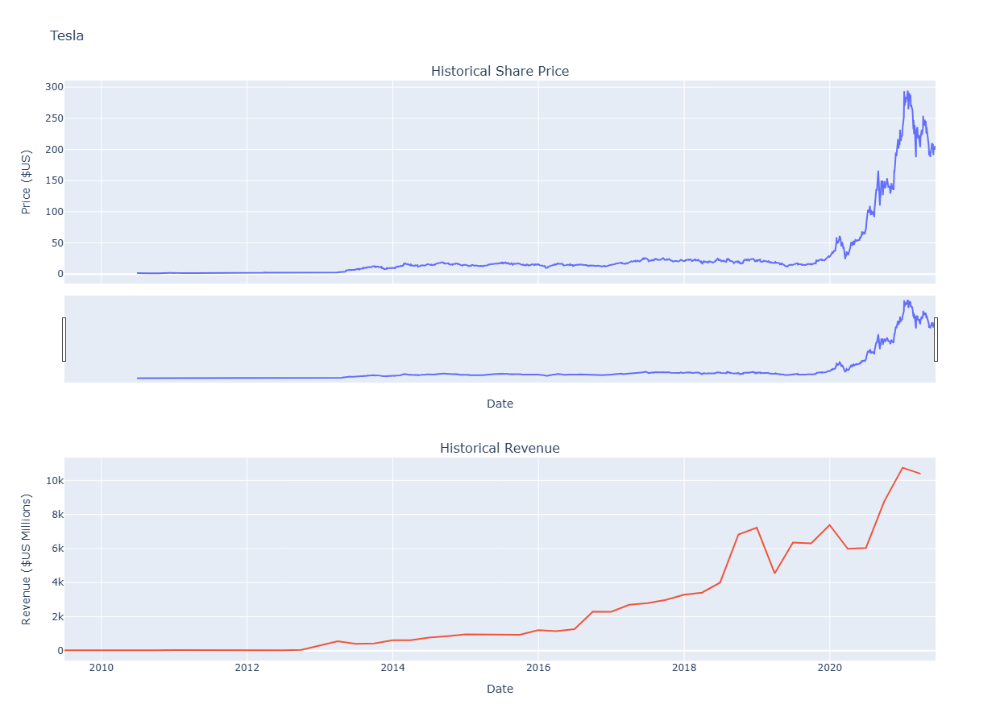

# Module 3: Extracting and Visualizing Data

**Author:** Alexander Booth  
**Date:** February 2026

---

## Overview

This module focuses on **getting data into your workflow**: from the web and from financial APIs. You use **web scraping** (HTML, Requests, BeautifulSoup) to extract information from web pages, and **Python libraries** (e.g. **yfinance**) to pull structured financial data. The goal is to go from “data out there” to **data in DataFrames and graphs** you can analyze.

The core takeaway:

> Data science starts with data. This module gives you the tools to **collect** data from web pages and financial sources, then **visualize** it so you can make decisions based on evidence.

---

## Why Data Extraction Matters

Real-world data is rarely in a single CSV on your machine. It lives on:

* **Web pages** — tables, lists, and text you want to analyze (e.g. revenue, rankings, listings)
* **Financial and market sources** — stock prices, revenue, dividends, company info

**Web scraping** and **libraries like yfinance** let you:

* Automate what would be hours of manual copying into a few minutes of code
* Build repeatable pipelines: same script, updated data
* Combine multiple sources (e.g. stock API + scraped revenue) into one analysis

The question “Where do I get the data?” is answered here: from the web and from APIs, using Python.

---

## What This Module Covers

The module is organized as a **progressive path** from HTML and scraping basics to a full stock-data extraction and visualization assignment.

### 1. HTML for Web Scraping

* **HTML basics** — Structure of a web page: DOCTYPE, `html`, `head`, `body`; how tags tell the browser what to display.
* **Composition of a tag** — Tag name, opening/closing tags, content; attributes (name and value) and how they encode links and metadata.
* **Document tree** — HTML as a tree: parent, children, siblings, descendants; navigating the structure you will parse in Python.
* **HTML tables** — `table`, `tr`, `th`, `td`; how tabular data is marked up so you can target it with BeautifulSoup.

### 2. Web Scraping with BeautifulSoup and Requests

* **What is web scraping** — Automatically extracting information from websites using code (e.g. player names and salaries, revenue tables).
* **BeautifulSoup** — Parsing HTML: passing a document into the BeautifulSoup constructor and working with the resulting object as a nested data structure.
* **BeautifulSoup objects** — **Tag** (corresponds to an HTML tag), **NavigableString** (text inside tags), and navigating the tree (e.g. `.parent`, `.next_sibling`, children).
* **Attributes** — Reading tag attributes (e.g. `id`, `href`) as key–value pairs.
* **Filtering** — **`find_all()`** and **`find()`**: filtering by tag name, attributes, or text to get the elements you need.
* **Requests** — Using the **Requests** library to **download** a web page (e.g. `requests.get(url)` and `.text`), then parsing it with BeautifulSoup.
* **End-to-end scraping** — Download page → parse with BeautifulSoup → find tags → extract content → build a DataFrame or list.

### 3. Web Scraping Review Lab

Hands-on practice with:

* **Beautiful Soup objects** — Tag, children/parents/siblings, HTML attributes, NavigableString.
* **Filters** — `find_all`, `find`, and filtering by tag name and attributes.
* **Downloading and scraping** — Fetching a live or sample web page and extracting structured data from it.

### 4. Extracting Stock Data with a Python Library

* **Stocks and tickers** — What a stock is; ticker symbols and where to get data.
* **yfinance** — The **yfinance** library: creating a **Ticker** object (e.g. `yf.Ticker("AAPL")`) to access stock data.
* **Stock info** — Extracting company and financial metadata (e.g. `info`) as a dictionary.
* **Historical data** — Using **`history()`** to get share price over time (Open, High, Low, Close, Volume) into a Pandas DataFrame.
* **Dividends** — Extracting historical dividends data when needed for analysis.

### 5. Extracting Stock Data with Web Scraping

When data is not available via an API:

* **HTTP request** — Sending a request to a URL (e.g. a financial or Wikipedia page) with Requests.
* **Parsing HTML** — Using BeautifulSoup to parse the page and locate tables or lists.
* **Building a DataFrame** — Identifying the right tags (e.g. `table`, `tr`, `td`), extracting text, and constructing a Pandas DataFrame (e.g. Date, Open, High, Low, Close, Volume).
* **Comparison** — When to use a library (yfinance) vs. web scraping (BeautifulSoup + Requests).

### 6. Final Assignment: Extracting and Visualizing Stock Data

The module culminates in a **capstone assignment** that ties everything together:

* **Define a graphing function** — A reusable `make_graph()` (e.g. with Plotly) for historical share price and revenue.
* **Question 1** — Use **yfinance** to extract **Tesla (TSLA)** stock data; `Ticker`, `history(period="max")`, reset index, display with `head()`.
* **Question 2** — Use **web scraping** to extract **Tesla revenue** from a web page; Requests + BeautifulSoup, then build a revenue DataFrame.
* **Question 3** — Use **yfinance** to extract **GameStop (GME)** stock data.
* **Question 4** — Use **web scraping** to extract **GameStop revenue** data.
* **Question 5** — **Plot Tesla** stock graph (share price and revenue) using the graphing function.
* **Question 6** — **Plot GameStop** stock graph (share price and revenue).

You combine **API-style data** (yfinance) and **scraped data** (BeautifulSoup) into a single analysis and visualization workflow.

**Sample outputs from the final assignment:**

#### Tesla

#### GameStop

---

## Key Takeaways

* **HTML** is the structure of web pages; understanding tags and the document tree is essential for reliable scraping.
* **Requests** fetches the page; **BeautifulSoup** parses it and lets you navigate and filter by tags and attributes.
* **`find_all()`** and **`find()`** are the main tools to isolate the elements that contain the data you need.
* **yfinance** provides a simple way to get stock and company data into Pandas (Ticker, history, info, dividends).
* **Web scraping** fills the gap when data is only on a web page (e.g. revenue tables) and no API is available.
* The **final assignment** shows a full pipeline: extract (API + scraping) → combine → visualize (e.g. Plotly) for real stocks (Tesla, GameStop).

---

## The Data Scientist’s Data-Collection Toolkit

Think of this module as building your **data-collection toolkit**, not just writing one-off scripts.

The goal is not to memorize every BeautifulSoup method or yfinance parameter.  
The goal is to **identify where your data lives (web page vs. API), fetch it (Requests + BeautifulSoup or yfinance), and get it into DataFrames and visualizations**—so you can focus on the next step: analysis, modeling, and decision-making.
