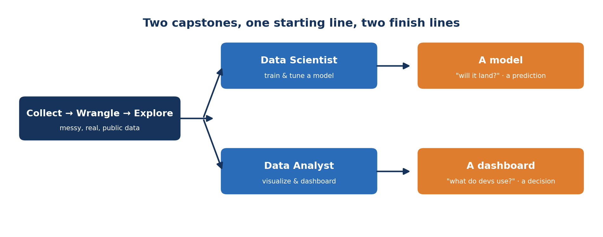
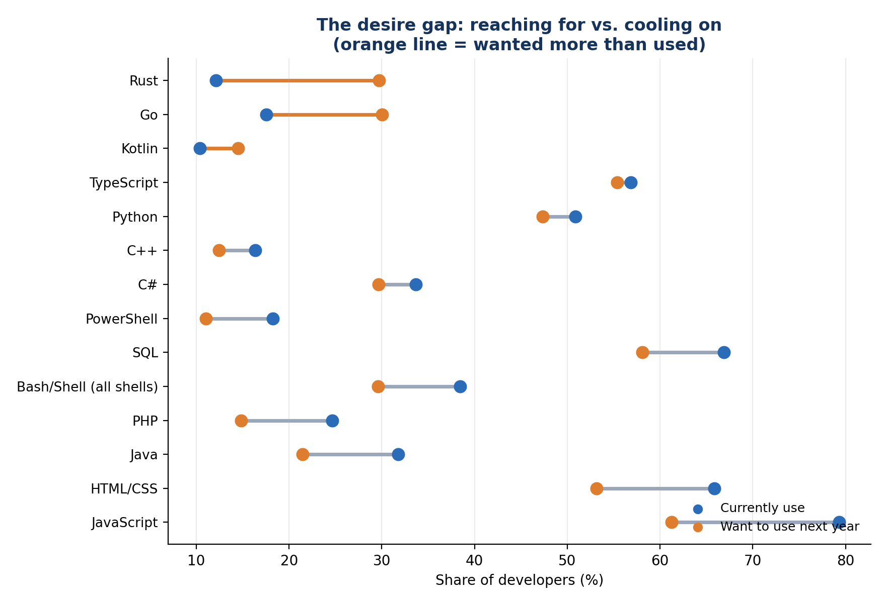
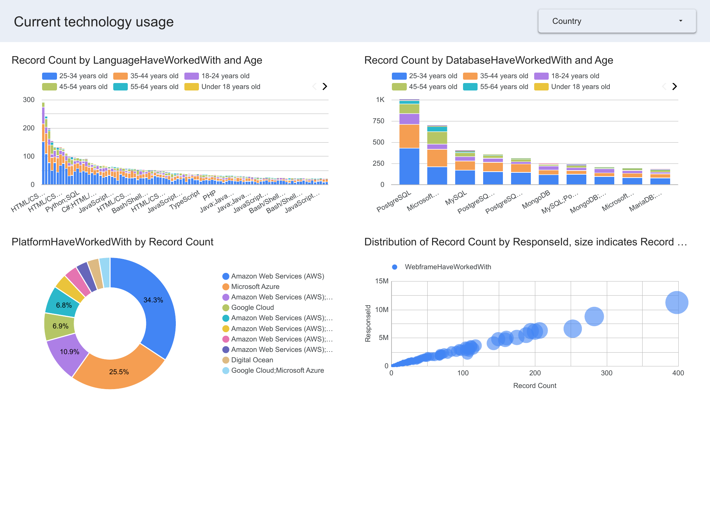
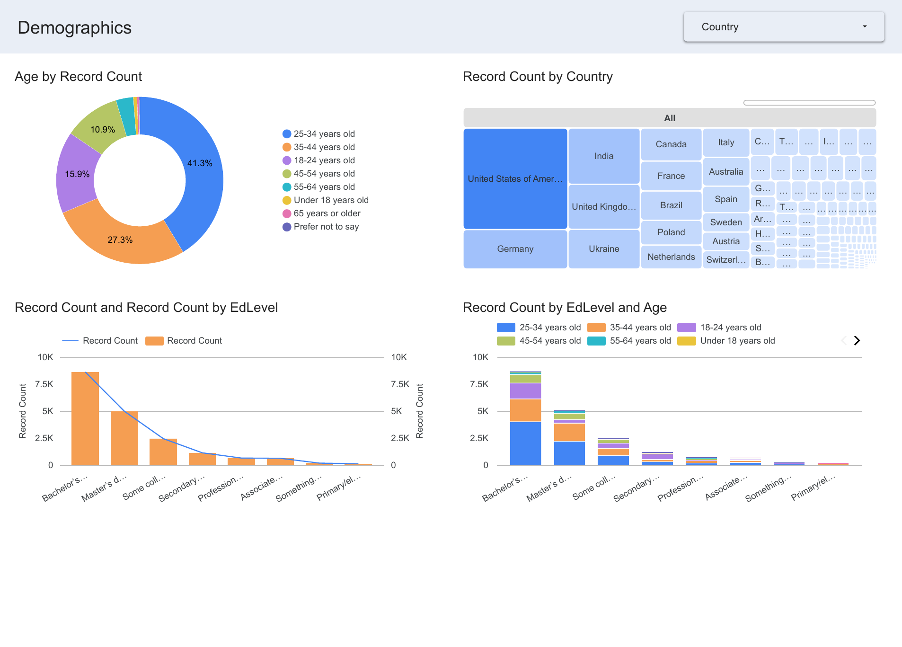

# When the Dashboard Is the Deliverable: Inside the Data Analyst Capstone

*The data analyst bootcamp ends where the data science one doesn't — not with a model, but with a story a stakeholder can act on. Here's the Stack Overflow Developer Survey capstone, and the places every cohort gets stuck. (Companion to my "Will it land?" SpaceX write-up.)*

I teach two IBM bootcamps: the [Data Scientist](https://www.coursera.org/professional-certificates/ibm-data-science) track and the [Data Analyst](https://www.coursera.org/professional-certificates/ibm-data-analyst) track. For nine weeks, they look almost like the same course. Both learn Python and SQL, both spend the back half on a capstone that starts in the same unglamorous place: find messy, real, public data and wrangle it into something usable.

Then the capstone forks. The data scientists build toward a prediction — I wrote about their SpaceX "will the rocket land?" project separately, and it ends in a model and a humbling confusion matrix. The data analysts go somewhere else entirely. No model. The finish line consists of dashboards and a presentation.

This post is about that second room.

## The brief: explain, don't predict

In the analyst capstone, you play the role of an Associate Data Analyst at a consulting firm. The client wants to understand the developer market — what people build with today and what they want to build with next — clearly enough to make strategic bets. Your raw material is the [Stack Overflow Annual Developer Survey](https://survey.stackoverflow.co/): tens of thousands of developers worldwide answering questions about their tools, pay, and preferences.

Notice the question. The data scientist asks what will happen. The data analyst asks what is happening. There's no target variable to predict and no model to train. The whole job is to turn a giant, messy survey into something a non-technical stakeholder can read and act on. That sounds easier than modeling. It isn't. It's just hard in a different place.

## Stuck point 1: Survey data is messy in its own way

The first wall isn't math. It's that survey answers don't arrive as tidy columns.

Ask a developer which languages they use, and the answer comes back as `JavaScript;Python;SQL` crammed into a single cell. Before you can count anything, you have to split those strings and [explode](https://pandas.pydata.org/docs/reference/api/pandas.Series.explode.html) them into a separate row for each language. `Age` shows up as text buckets like `25-34 years old`, not numbers, so any average or box plot means mapping buckets to midpoints first. `YearsCodePro` mixes real numbers with `"Less than 1 year"` and `"More than 50 years"`. Compensation has a few absurd outliers that flatten every chart until you cap them at the 99th percentile.

None of this is glamorous, and all of it is the job. Students who rush past it produce charts that are quietly wrong. The ones who slow down here produce charts that hold up.

## The payoff: a finding falls out

Once the survey is clean, the analysis is fast, and the story is real. Split the "have worked with" and "want to work with" language columns, line them up, and a genuine insight appears:

*JavaScript, SQL, and HTML/CSS are everywhere — but fewer developers want to keep reaching for them. Rust, Go, and Kotlin are wanted far more than they're currently used.*

JavaScript is used by 79% of developers and wanted by 61% — an 18-point drop. Rust runs the other way: 12% use it, 30% want to. That "desire gap" is exactly the kind of forward-looking read a consulting client pays for, and it's worth being clear about what it is: not a prediction, just an honest picture of where the market is leaning. That picture is the data analyst's product.

## The deliverable is the dashboard

Here's the part that trips up students who think the notebook is the finish line. It isn't. The capstone ends in [Looker Studio](https://lookerstudio.google.com/), with three dashboards a stakeholder can filter and explore on their own: current technology usage, future trends, and demographics.

*What developers use today — languages, databases, platforms — broken out by age and filterable by country. One of the three required dashboards.*

*Age, country, and education level, so every other chart can be read in context.*

Building these is where the real skill shows, and it has almost nothing to do with code. It's choosing a stacked bar chart over a pie chart. It's labeling an axis so nobody has to ask what they're looking at. It's resisting the urge to put eleven slices in a donut. The hardest, most underrated thing in the whole bootcamp is picking the right chart for the question and telling an honest story with it. In this track, the chart is the deliverable, and the final presentation is graded on whether a stakeholder can actually follow it.

## Why it's the right capstone for an analyst

The data science capstone humbles you with a model that won't behave. This one humbles you with a dashboard that has to be understood by someone who has never opened your notebook. One fights the math, while the other fights for clarity… which is much harder to fake.

That's the real definition of "done" for a data analyst: not a model that predicts, but a stakeholder who can decide. The messy first half — collect, wrangle, explore — is shared with the data scientist, because that part is the job, no matter which room you end up in. It's the last two weeks that reveal which job you actually signed up for.

So if you're weighing the two tracks, skip the buzzwords and ask the real question: do you want to build the thing that predicts, or the thing that explains? This project is the one that explains. And if you want to see the other perspective, the SpaceX "will it land?" capstone is its sibling.

---

*This blog is the companion to my write-up of the Data Science capstone (the SpaceX "will it land?" project). Both use public data — the SpaceX API and the [Stack Overflow Developer Survey](https://survey.stackoverflow.co/). The desire-gap chart is built from a cleaned subset of 18,845 responses from the survey; the dashboards are the capstone's own Looker Studio build.*
