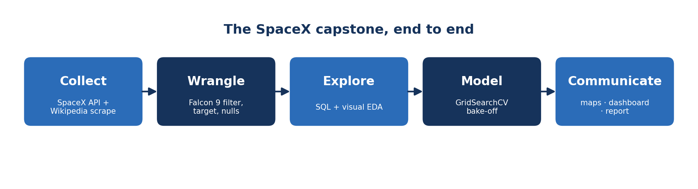
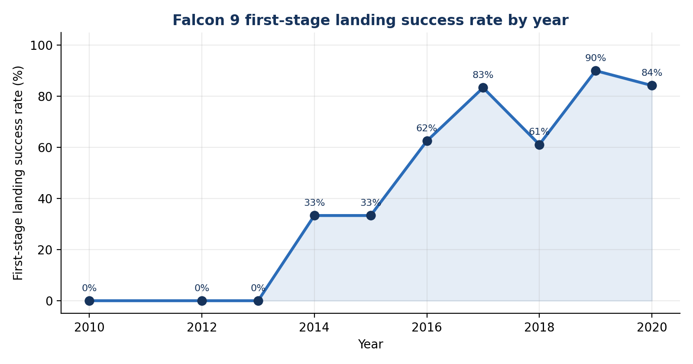
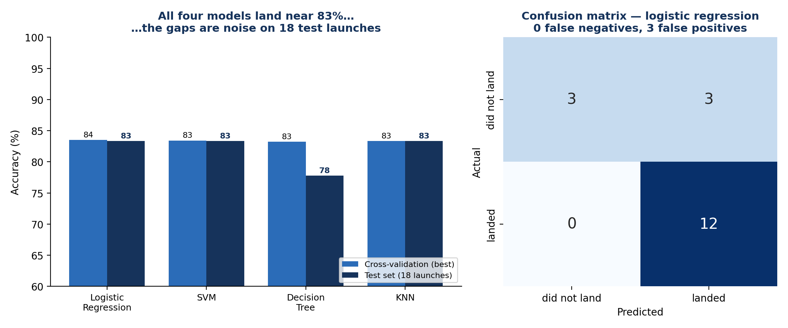
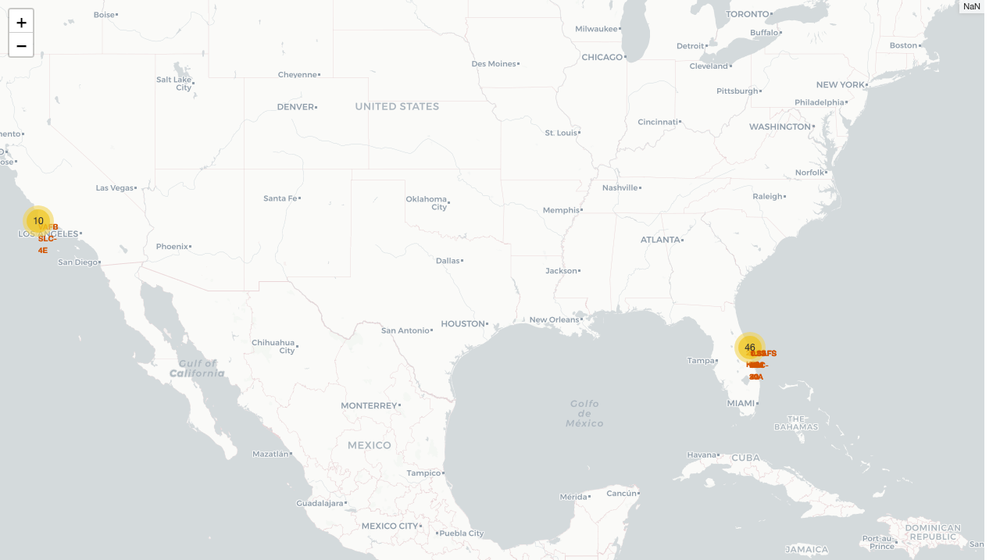
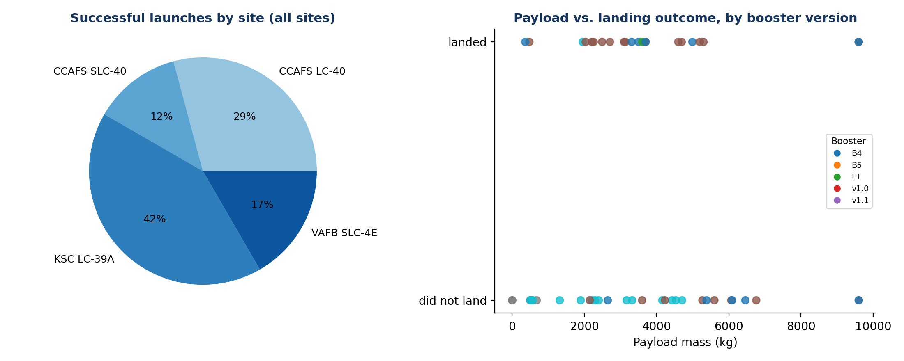

# Will It Land? Why the SpaceX Capstone Is the Best First Data Science Project

*I teach this project to every cohort. It's the week students stop following tutorials and start doing data science. Here are the five places they predictably get stuck.*

Every data science course ends with a capstone, and most of them are forgettable. Clean CSV, predict the column, submit the notebook. The SpaceX capstone is different. By the end of it, students stop asking "what does the assignment want" and start asking "what does the data say." That shift is the whole point of the course, and this is the project where it finally clicks.

The premise is great on its own. SpaceX reuses the [Falcon 9](https://www.spacex.com/vehicles/falcon-9/) first stage, which is why a launch costs about $62 million rather than the $165 million charged by the competition. If you can predict whether the first stage lands, you can predict the launch price. The students play data scientists for a fictional competitor, "Space Y," trying to size up SpaceX using only public data. Rockets, real money, a yes/no question. They're hooked before the first cell runs.

What they don't realize yet is that the rocket is the hook, not the lesson. The lesson is the pipeline: collect, wrangle, explore, model, communicate. Here's where each stage trips them up, and why that's exactly what I want.



## 1. The data isn't a table yet

The first shock is that there's no dataset. There's an API and a Wikipedia page.

The [SpaceX REST API](https://github.com/r-spacex/SpaceX-API) hands back nested JSON, and [`pd.json_normalize`](https://pandas.pydata.org/docs/reference/api/pandas.json_normalize.html) flattens it into a DataFrame, but half the useful columns are still just IDs. The rocket is an ID. The launchpad is an ID. The payload is an ID. To turn those into a booster name, a launch site, a payload mass, you have to make a second round of API calls for each one. Students hit this and freeze, because nothing in the earlier modules looked like this.

That's the lesson. Real data lives behind systems, not in files, and you rarely get everything in one request. The web-scraping half drives it home: pull a [Wikipedia launch table](https://en.wikipedia.org/wiki/List_of_Falcon_9_and_Falcon_Heavy_launches) with [BeautifulSoup](https://www.crummy.com/software/BeautifulSoup/bs4/doc/) and the first thing you get is a `403`, because you forgot a `User-Agent` header. Then you learn the difference between `.string` and `.strings` the hard way, parsing cells full of reference links and footnotes, and `N/A` noise.

Most of the job, as it turns out, is getting the data into a usable state. That sentence is on a slide in week one. They don't believe it until week nine.

## 2. The target variable is a judgment call

Once the launches are in a table, there's a column called `Outcome` with values like `True ASDS`, `False Ocean`, and `None`. The assignment asks for a model that predicts landing success. So what counts as success?

This stops people cold, and it should. `True ASDS` means it landed on a drone ship. `None` means there was no landing attempt at all. You, the analyst, have to decide how those map to a binary label. The standard move is to collect the failure cases into a set and encode everything else as a success:

```python
bad_outcomes = {'False ASDS', 'False Ocean', 'False RTLS', 'None ASDS', 'None None'}
df['Class'] = [0 if outcome in bad_outcomes else 1 for outcome in df['Outcome']]
```

That one list comprehension is a modeling decision disguised as data cleaning. Change what goes in `bad_outcomes`, and you change every result downstream. The landing success rate is 66.7% — 60 of 90 launches — and that number carries through to the confusion matrix.

The same judgment shows up with missing data. The `LandingPad` column is about 29% null, and the instinct is to fill it or drop it. But a null landing pad means no pad was used, which is a signal, not noise. You keep it. Wrangling is where projects are quietly won or lost, and it's the stage that looks the least like "data science" to a beginner.

## 3. EDA is the project, not the warm-up

Students treat exploratory analysis like stretching before the real workout. Then they plot landing success over time and go quiet.

The Falcon 9 first-stage success rate is essentially 0% through 2013, jumps past 60% by 2016, and climbs into the high 80s by 2020. The chart is the story of SpaceX learning to land a rocket. It also tells you something useful for modeling: flight number is a stand-in for operational maturity. Later flights succeed more often because the program got better, not because of anything in the payload.


*Built from the wrangled launch data: 0% through 2013, then a steady climb as the program matures. The wobble in 2018 is what small numbers look like.*

The rest of the EDA is the same shape. One launch site carries most of the volume. Heavy payloads behave differently in different orbits. None of these are surprises if you know rockets, and that's the point I make every cohort: good EDA turns domain intuition into features. By the time you've explored honestly, you've already decided what to model. The model is downstream of the looking.

## 4. The model is the easy part, and a reality check

After all that, the modeling lab is almost gentle. [One-hot encode](https://pandas.pydata.org/docs/reference/api/pandas.get_dummies.html) the categoricals into about 80 features, [standardize](https://scikit-learn.org/stable/modules/generated/sklearn.preprocessing.StandardScaler.html), [split](https://scikit-learn.org/stable/modules/generated/sklearn.model_selection.train_test_split.html), and let [`GridSearchCV`](https://scikit-learn.org/stable/modules/generated/sklearn.model_selection.GridSearchCV.html) tune a handful of classifiers.

```python
X = StandardScaler().fit_transform(features)
X_train, X_test, Y_train, Y_test = train_test_split(X, Y, test_size=0.2, random_state=2)
# 72 launches to train on, 18 to test on
```

Here's where the project earns its keep as a teaching tool. The students run Logistic Regression, SVM, a Decision Tree, and KNN, each tuned with cross-validation, fully expecting a winner. The cross-validation scores come back, and they're almost identical — every model lands within a point of 83% — no horse race. The test set doesn't break the tie so much as scramble it: three models score 83% (15 of 18 correct), and the decision tree slips to 78% (14 of 18 correct). On eighteen launches, a single rocket is worth five and a half points, so none of that spread means anything at all.


*Four tuned classifiers, all clustered around 83%. The test-set "differences" are one or two launches — noise. The confusion matrix and ROC AUC carry the real signal.*

That non-result is the most valuable thing in the whole capstone. You cannot crown a model on this much data, and the accuracy number was never going to tell you which is best. So you stop reading the leaderboard and look at *how* the models are wrong. The confusion matrix tells the real story: every one of the 12 landings gets caught (zero false negatives), but half of the 6 failures slip through as false positives. And [ROC AUC](https://scikit-learn.org/stable/modules/generated/sklearn.metrics.roc_auc_score.html), which actually cares about ranking the predictions, finally separates the pack — logistic regression's 0.92 edges out the rest. The headline accuracy was a coin flip. The error shape and the AUC were the signal.

A model is an approximation, not an oracle, and a small test set will happily flatter all of them at once. Students who learn that on 18 rocket launches don't forget it on a million customer records.

## 5. It's not done until someone can use it

The last trap is thinking the notebook is the deliverable. It isn't. Stakeholders don't read notebooks.

So the capstone closes with the parts that feel least like data science and matter most. A [Folium](https://python-visualization.github.io/folium/) map plots every launch site and color-codes successes against failures, which makes "this site is more reliable" a thing you can see instead of a row in a table.


*The Folium map students build: clusters on the Florida and California coasts, each launch colored by outcome. Geography becomes an argument.*

Then a [Plotly Dash](https://dash.plotly.com/) app turns the analysis into something a non-engineer can drive: a dropdown for launch site, a slider for payload, a pie chart, and a scatter that reacts to both. Wiring that first multi-input callback is its own small wall to climb.


*The same questions, made interactive: which site wins, and how payload and booster version relate to landing.*

And then they write it up. Problem, data, methods, results, limitations. Not a dump of cells. The project isn't finished when the model trains. It's finished when someone who never opened the notebook can act on what you found.

## Why this one works

I've watched a lot of capstones. This is the one where students email me to say they finally get it.

It works because it refuses to be clean. The data has to be hunted down and stitched together. The target is a decision. The interesting findings come from looking, not from the algorithm. The model humbles you on a small dataset. And none of it counts until it's communicated. That's not a rocket project. That's the actual job, compressed into two weeks and wrapped around a question — will it land? — that nobody can resist trying to answer.

The Falcon 9 is just the vessel. Swap in churn, or fraud, or demand forecasting, and the arc is identical: collect the messy thing, decide what the labels mean, explore until you understand, model with humility, and hand someone a tool instead of a notebook. The rocket is what gets them to show up. The pipeline is what they take with them.

---

*This blog walks through the SpaceX Falcon 9 capstone from the [IBM Data Science program](https://www.coursera.org/professional-certificates/ibm-data-science). The data is public — the [SpaceX REST API](https://github.com/r-spacex/SpaceX-API) and [Wikipedia launch records](https://en.wikipedia.org/wiki/List_of_Falcon_9_and_Falcon_Heavy_launches) — so anyone can run the whole thing end-to-end. Figures are generated from the capstone's own datasets.*
